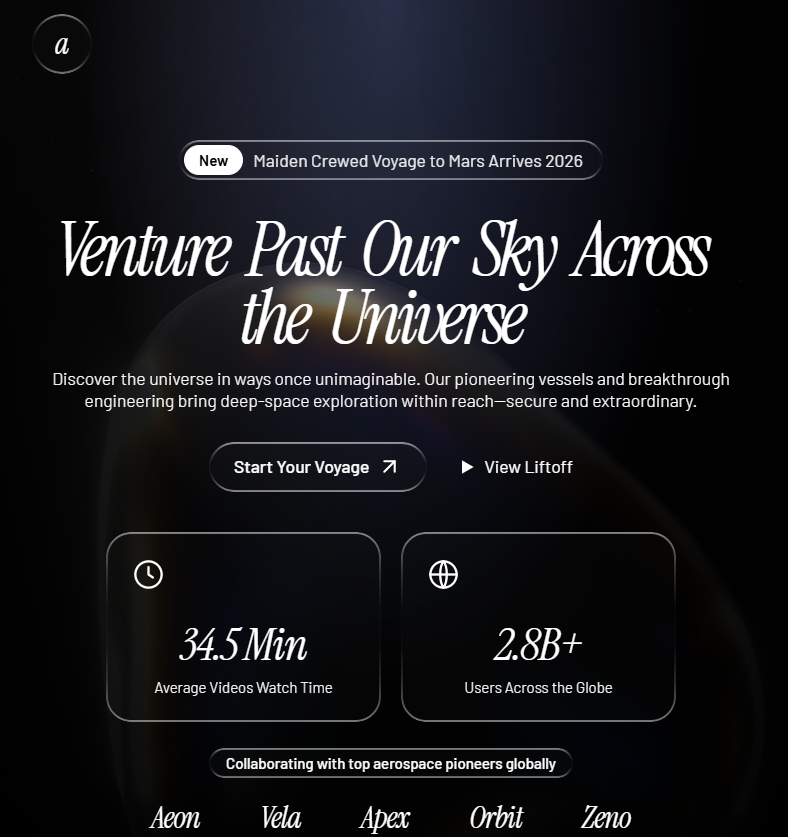

# cinematic-spec

> Write frontend build prompts precise enough to reproduce a UI without design files.

**cinematic-spec** is a structured prompt format for spec-ing out UI builds with exact Tailwind classes, animation values, asset URLs, inline SVGs, and copy text. It turns rough design ideas into specification documents that any developer — or AI — can build from, pixel-perfectly.

No "approximately." No "something like." Every value is literal. Every class string is verbatim. The output is a **spec**, not a description.

---

## Preview

<p align="center">
  
</p>

*Spec produced by cinematic-spec for the "Space Exploration Hero" design.*

---

## Examples

- [Space Exploration Hero](examples/space-voyage-spec.md) — A cinematic dark-mode hero section with glassmorphism and animated typography.


---

## Why

Design handoff tools exist, but most UI work still happens from screenshots, Slack messages, and vague briefs like "make it glassmorphic with some animations." That leaves builders guessing on colors, spacing, timing, and structure.

cinematic-spec fills the gap between design intent and implementation. The output is dense enough that a competent builder reads it top-down and builds without asking questions.

---

## What It Looks Like

A cinematic-spec prompt follows this structure:

```
Build Prompt: [Name]
[One-sentence description]

Tech stack (pinned, CDN-only)
Fonts
Design System / Global Utilities
Shared Components (defined once)
Page Sections
  Background / Media
  Layout Shell
  Components (top to bottom)
Icons (inline SVGs)
Notes
```

Every section is concrete:

| Instead of | It writes |
|---|---|
| "Use a glassmorphism style" | Full `.glass-card` CSS block verbatim |
| "Add a slight delay" | `delay: 0.4` |
| "Something like Framer Motion" | Exact `motion.div` props |
| "A nice italic serif font" | `font-heading italic text-[5.5rem]` |
| "An arrow icon" | SVG path `d="M7 17L17 7 M7 7h10v10"` |
| "Fade the video in and out" | Full `fadeTo()` rAF spec with timing constants |
| "Use Tailwind for layout" | `flex items-center justify-between gap-4 px-8 lg:px-16` |
| "Approximate the spacing" | `mt-6 gap-6 p-5 w-[220px] rounded-[1.25rem]` |

---

## Document Structure

A complete spec is layered — global first, then section-by-section, then component-by-component, then behavior detail.

### 1. Title Line

```
Build Prompt: VOID — Personal Aesthetic Homepage
```

One sentence: what the build produces at the highest level.

### 2. Tech Stack

Pinned dependencies with full CDN tags, integrity hashes where available, framework wiring, and body/root defaults.

```html
<script src="https://unpkg.com/react@18.2.0/umd/react.production.min.js"></script>
<script src="https://unpkg.com/framer-motion@11.0.0/dist/framer-motion.js"></script>
```

### 3. Fonts

Google Fonts import line, Tailwind `fontFamily` config, and usage notes per font.

### 4. Design System / Global Utilities

Custom CSS classes with full verbatim CSS in fenced code blocks. One class = one code block. Pseudo-element variants included.

```css
.glass-card {
  background: rgba(255, 255, 255, 0.03);
  border: 1px solid rgba(255, 255, 255, 0.06);
  border-radius: 1rem;
  backdrop-filter: blur(12px);
}
```

### 5. Shared Components

Reusable components defined once with behavior as numbered steps, timing constants, event handlers, and cleanup logic.

### 6. Page Sections

Each section specifies:

- **Background / Media** — asset URL, positioning classes, inline style overrides, overlay treatment
- **Layout Shell** — container classes, z-index map, flex/grid structure
- **Components** — position/layout classes, children (element type, classes, text, icons, Framer Motion props), state/interaction behavior

### 7. Icons

Inline SVGs with verbatim `viewBox`, path `d` attributes, `strokeWidth`, `fill`, and `linecap`.

### 8. Notes

Implementation gotchas, browser compatibility caveats, intentional-looking-but-correct behaviors.

---

## Formatting Rules

### Class Strings

Write Tailwind classes exactly as they appear. No line breaks mid-class-string. No paraphrasing.

### Colors and Values

Always literal:
- `rgba(255,255,255,0.01)` not "near-transparent white"
- `text-[5.5rem]` not "roughly 88px"
- `delay: 0.4` not "slight delay"
- `tracking-[-4px]` not "tight tracking"

### Text Copy

All UI copy wrapped in quotes. Never paraphrased.

### Animation Specs

Full object form with `initial`, `animate`, `transition` (including `delay`). Keyframe arrays include `times`.

```js
initial: { filter: 'blur(10px)', opacity: 0, y: 20 }
animate: { filter: 'blur(0px)', opacity: 1, y: 0 }
transition: { duration: 0.7, delay: 0.4, ease: 'easeOut' }
```

### SVG Path Data

Inline verbatim. Never describe an icon in prose when path data is available.

### Behavior Specs

Numbered steps. Constants named upfront. Variable names in code-style.

---

## Quality Checklist

Before finalizing a build prompt:

- [ ] Every dependency has a pinned version
- [ ] Every color/opacity/size is a literal value
- [ ] Every component has exact class strings
- [ ] All text copy is quoted verbatim
- [ ] All animations have `initial` + `animate` + `transition` (with `delay`)
- [ ] Shared components defined once, not re-described per use
- [ ] SVG paths are literal `d` attribute strings
- [ ] Background media URLs are full absolute URLs
- [ ] A Notes section exists for implementation caveats
- [ ] DOM order matches visual order (top to bottom, left to right)

---

## Installation

### OpenClaude / Claude Code

```bash
git clone https://github.com/KishanDavda-IT/cinematic-spec-skill.git ~/.claude/skills/cinematic-spec
```

The skill auto-registers from its `SKILL.md` frontmatter. No config needed.

### Manual Use

Copy `SKILL.md` content and paste it into your system prompt or project instructions. The format is self-contained — no scripts, no dependencies.

---

## Usage

Trigger phrases:

- "write a build prompt"
- "spec out a landing page"
- "turn this design into a prompt"
- "make a prompt for a dev to build"
- "cinematic prompt"
- "build spec"
- "format this UI as a spec"

The skill handles both directions:

1. **From scratch** — describe a UI, get a complete spec
2. **From draft** — paste a rough prompt, get it back with exact values, class strings, and animation specs filled in

---

## Contributing

1. Fork the repo
2. Create a branch (`git checkout -b feat/new-section`)
3. Make changes to `SKILL.md` or add examples in `examples/`
4. Open a PR with a clear description of what changed and why

---

## License

MIT
