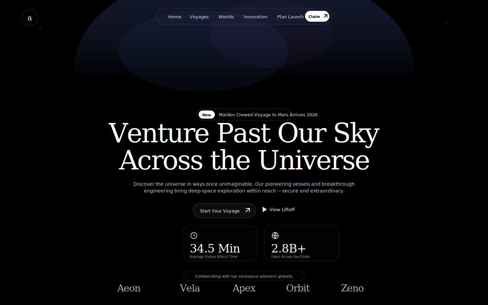

  ---
  # cinematic-spec                                                                                                      
  > Write frontend build prompts precise enough to reproduce a UI without design files.                                 
  **cinematic-spec** is a structured prompt format for spec-ing out UI builds with exact Tailwind classes, animation
  values, asset URLs, inline SVGs, and copy text. It turns rough design ideas into specification documents that any
  developer — or AI — can build from, pixel-perfectly.

  No "approximately." No "something like." Every value is literal. Every class string is verbatim. The output is a
  **spec**, not a description.

  ---

  ## Why

  Design handoff tools exist, but most UI work still happens from screenshots, Slack messages, and vague briefs like
  "make it glassmorphic with some animations." That leaves builders guessing on colors, spacing, timing, and structure.

  cinematic-spec fills the gap between design intent and implementation. The output is dense enough that a competent
  builder reads it top-down and builds without asking questions.

  ---

  ## What It Looks Like

  A cinematic-spec prompt follows this structure:

  Build Prompt: [Name]
  [One-sentence description]

  Tech stack (pinned, CDN-only)
  Fonts
  Design System / Global Utilities
  Shared Components (defined once)
  Page Sections
    Background / Media
    Layout Shell
    Components (top to bottom)
  Icons (inline SVGs)
  Notes

  Every section is concrete:

  | Instead of | It writes |
  |---|---|
  | "Use a glassmorphism style" | Full `.glass-card` CSS block verbatim |
  | "Add a slight delay" | `delay: 0.4` |
  | "Something like Framer Motion" | Exact `motion.div` props |
  | "A nice italic serif font" | `font-heading italic text-[5.5rem]` |
  | "An arrow icon" | SVG path `d="M7 17L17 7 M7 7h10v10"` |
  | "Fade the video in and out" | Full `fadeTo()` rAF spec with timing constants |
  | "Use Tailwind for layout" | `flex items-center justify-between gap-4 px-8 lg:px-16` |
  | "Approximate the spacing" | `mt-6 gap-6 p-5 w-[220px] rounded-[1.25rem]` |

  ---

  ## Document Structure

  A complete spec is layered — global first, then section-by-section, then component-by-component, then behavior detail.

  ### 1. Title Line

 ## Preview

  

    
  

  > [Live demo →](./demo/index.html)

  And here's the preview.svg content:

  <svg xmlns="http://www.w3.org/2000/svg" viewBox="0 0 1200 800" width="1200" height="800">
    <defs>
      <linearGradient id="grad" x1="0%" y1="0%" x2="100%" y2="100%">
        <stop offset="0%" stop-color="#c084fc"/>
        <stop offset="50%" stop-color="#818cf8"/>
        <stop offset="100%" stop-color="#67e8f9"/>
      </linearGradient>
      <linearGradient id="border" x1="0%" y1="0%" x2="100%" y2="100%">
        <stop offset="0%" stop-color="rgba(255,255,255,0.06)"/>
        <stop offset="100%" stop-color="rgba(255,255,255,0.02)"/>
      </linearGradient>
      <filter id="glow">
        <feGaussianBlur stdDeviation="6" result="blur"/>
        <feMerge><feMergeNode in="blur"/><feMergeNode in="SourceGraphic"/></feMerge>
      </filter>
      <filter id="noise">
        <feTurbulence type="fractalNoise" baseFrequency="0.65" numOctaves="3" stitchTiles="stitch"/>
        <feColorMatrix type="saturate" values="0"/>
      </filter>
    </defs>

    <!-- Background -->
    <rect width="1200" height="800" fill="#000000"/>

    <!-- Noise overlay -->
    <rect width="1200" height="800" filter="url(#noise)" opacity="0.035"/>

    <!-- Ambient glow -->
    <ellipse cx="600" cy="360" rx="350" ry="250" fill="rgba(124,58,237,0.08)"/>
    <ellipse cx="400" cy="500" rx="200" ry="180" fill="rgba(34,211,238,0.04)"/>

    <!-- Navbar -->
    <g opacity="0.5">
      <!-- Glow dot -->
      <circle cx="48" cy="32" r="3" fill="#a78bfa" filter="url(#glow)"/>
      <text x="60" y="36" font-family="monospace" font-size="10" fill="rgba(255,255,255,0.5)"
  letter-spacing="2">VØID.SYS</text>

      <text x="460" y="36" font-family="monospace" font-size="10" fill="rgba(255,255,255,0.3)" letter-spacing="3">01.
  ABOUT</text>
      <text x="560" y="36" font-family="monospace" font-size="10" fill="rgba(255,255,255,0.3)" letter-spacing="3">02.
  WORK</text>
      <text x="655" y="36" font-family="monospace" font-size="10" fill="rgba(255,255,255,0.3)" letter-spacing="3">03.
  CONTACT</text>

      <rect x="1095" y="20" width="60" height="24" rx="12" fill="none" stroke="rgba(255,255,255,0.08)"
  stroke-width="1"/>
      <text x="1106" y="36" font-family="monospace" font-size="9" fill="rgba(255,255,255,0.5)" letter-spacing="2">PING
  ↗</text>
    </g>

    <!-- Hero: VØID title -->
    <text x="600" y="420" text-anchor="middle" font-family="sans-serif" font-weight="700" font-size="160"
  letter-spacing="-6" fill="url(#grad)">VØID</text>

    <!-- Subtitle -->
    <text x="600" y="465" text-anchor="middle" font-family="monospace" font-size="12" fill="rgba(255,255,255,0.4)"
  letter-spacing="4" text-transform="uppercase">PERSONAL AESTHETIC · DIGITAL VOID</text>

    <!-- Status line -->
    <g opacity="0.3" transform="translate(600,500)">
      <circle cx="-50" cy="-3" r="3" fill="#a78bfa" filter="url(#glow)"/>
      <text x="-38" y="0" font-family="monospace" font-size="9" fill="rgba(255,255,255,0.3)" letter-spacing="3">ONLINE ·
   BUILDING</text>
    </g>

    <!-- Scroll indicator -->
    <g opacity="0.2" transform="translate(600,720)">
      <text x="0" y="0" text-anchor="middle" font-family="monospace" font-size="8" fill="rgba(255,255,255,0.2)"
  letter-spacing="4">SCROLL</text>
      <line x1="0" y1="12" x2="0" y2="44" stroke="rgba(255,255,255,0.3)" stroke-width="1"/>
    </g>

    <!-- Glass card: About section (bottom-left hint) -->
    <g transform="translate(60,560)">
      <rect x="0" y="0" width="240" height="140" rx="16" fill="rgba(255,255,255,0.03)" stroke="rgba(255,255,255,0.06)"
  stroke-width="1"/>
      <text x="20" y="30" font-family="monospace" font-size="9" fill="rgba(255,255,255,0.25)" letter-spacing="3">01 /
  ABOUT</text>
      <rect x="20" y="48" width="180" height="6" rx="3" fill="rgba(255,255,255,0.06)"/>
      <rect x="20" y="62" width="140" height="6" rx="3" fill="rgba(255,255,255,0.04)"/>
      <rect x="20" y="76" width="160" height="6" rx="3" fill="rgba(255,255,255,0.04)"/>
      <!-- Tags -->
      <g transform="translate(20,100)">
        <rect x="0" y="0" width="50" height="20" rx="10" fill="none" stroke="rgba(255,255,255,0.08)" stroke-width="1"/>
        <text x="12" y="14" font-family="monospace" font-size="7" fill="rgba(255,255,255,0.3)"
  letter-spacing="1">DESIGN</text>
        <rect x="58" y="0" width="75" height="20" rx="10" fill="none" stroke="rgba(255,255,255,0.08)" stroke-width="1"/>
        <text x="68" y="14" font-family="monospace" font-size="7" fill="rgba(255,255,255,0.3)"
  letter-spacing="1">ENGINEERING</text>
        <rect x="141" y="0" width="55" height="20" rx="10" fill="none" stroke="rgba(255,255,255,0.08)"
  stroke-width="1"/>
        <text x="151" y="14" font-family="monospace" font-size="7" fill="rgba(255,255,255,0.3)"
  letter-spacing="1">MOTION</text>
      </g>
    </g>

    <!-- Glass card: Project (bottom-right hint) -->
    <g transform="translate(900,560)">
      <rect x="0" y="0" width="240" height="140" rx="16" fill="rgba(255,255,255,0.05)" stroke="rgba(255,255,255,0.1)"
  stroke-width="1"/>
      <text x="20" y="28" font-family="monospace" font-size="9" fill="rgba(255,255,255,0.15)"
  letter-spacing="2">01</text>
      <text x="20" y="56" font-family="sans-serif" font-size="18" font-weight="600"
  fill="rgba(255,255,255,0.8)">Spectre</text>
      <rect x="20" y="72" width="180" height="5" rx="2.5" fill="rgba(255,255,255,0.06)"/>
      <rect x="20" y="83" width="140" height="5" rx="2.5" fill="rgba(255,255,255,0.04)"/>
      <!-- Arrow icon -->
      <g transform="translate(208,20)" opacity="0.4">
        <line x1="0" y1="10" x2="10" y2="0" stroke="white" stroke-width="1.5" stroke-linecap="round"/>
        <polyline points="0,0 10,0 10,10" fill="none" stroke="white" stroke-width="1.5" stroke-linecap="round"
  stroke-linejoin="round"/>
      </g>
      <!-- Tags -->
      <g transform="translate(20,104)">
        <rect x="0" y="0" width="40" height="18" rx="9" fill="none" stroke="rgba(255,255,255,0.06)" stroke-width="1"/>
        <text x="10" y="13" font-family="monospace" font-size="7" fill="rgba(255,255,255,0.2)"
  letter-spacing="1">REACT</text>
        <rect x="48" y="0" width="42" height="18" rx="9" fill="none" stroke="rgba(255,255,255,0.06)" stroke-width="1"/>
        <text x="55" y="13" font-family="monospace" font-size="7" fill="rgba(255,255,255,0.2)"
  letter-spacing="1">WEBGL</text>
        <rect x="98" y="0" width="34" height="18" rx="9" fill="none" stroke="rgba(255,255,255,0.06)" stroke-width="1"/>
        <text x="106" y="13" font-family="monospace" font-size="7" fill="rgba(255,255,255,0.2)"
  letter-spacing="1">GLSL</text>
      </g>
    </g>

    <!-- Stats row (bottom center) -->
    <g transform="translate(370,580)">
      <rect x="0" y="0" width="100" height="70" rx="12" fill="rgba(255,255,255,0.03)" stroke="rgba(255,255,255,0.06)"
  stroke-width="1"/>
      <text x="50" y="32" text-anchor="middle" font-family="sans-serif" font-size="24" font-weight="700"
  fill="url(#grad)">47</text>
      <text x="50" y="52" text-anchor="middle" font-family="monospace" font-size="8" fill="rgba(255,255,255,0.25)"
  letter-spacing="2">PROJECTS</text>

      <rect x="115" y="0" width="100" height="70" rx="12" fill="rgba(255,255,255,0.03)" stroke="rgba(255,255,255,0.06)"
  stroke-width="1"/>
      <text x="165" y="35" text-anchor="middle" font-family="sans-serif" font-size="24" font-weight="700"
  fill="url(#grad)">∞</text>
      <text x="165" y="52" text-anchor="middle" font-family="monospace" font-size="8" fill="rgba(255,255,255,0.25)"
  letter-spacing="2">LOOPS</text>

      <rect x="230" y="0" width="100" height="70" rx="12" fill="rgba(255,255,255,0.03)" stroke="rgba(255,255,255,0.06)"
  stroke-width="1"/>
      <text x="280" y="32" text-anchor="middle" font-family="sans-serif" font-size="24" font-weight="700"
  fill="url(#grad)">0</text>
      <text x="280" y="52" text-anchor="middle" font-family="monospace" font-size="8" fill="rgba(255,255,255,0.25)"
  letter-spacing="2">COMPROMISES</text>
    </g>

    <!-- Footer -->
    <text x="600" y="778" text-anchor="middle" font-family="monospace" font-size="8" fill="rgba(255,255,255,0.1)"
  letter-spacing="4">© 2026 VOID</text>
  </svg>

  Notes

  - NoiseCanvas runs at 12fps via setInterval, not raw rAF — avoids 60fps waste on a 256×256 random fill.
  - mix-blend-mode: screen requires pure #000000 body background. Any deviation makes noise invisible.
  - The Ø in "VØID" is Unicode U+00D8 (Latin Capital Letter O with Stroke), not a zero. Space Grotesk supports it.
  - Framer Motion filter animations require the motion component — CSS transitions don't interpolate blur as smoothly.
  - backdrop-filter: blur() has known Firefox performance issues with large scroll areas. Reduce to 8px if janky.

  ---
  Contributing

  1. Fork the repo
  2. Create a branch (git checkout -b feat/new-section)
  3. Make changes to SKILL.md or add examples in examples/
  4. Open a PR with a clear description of what changed and why

  ---
  License

  MIT

  ---
